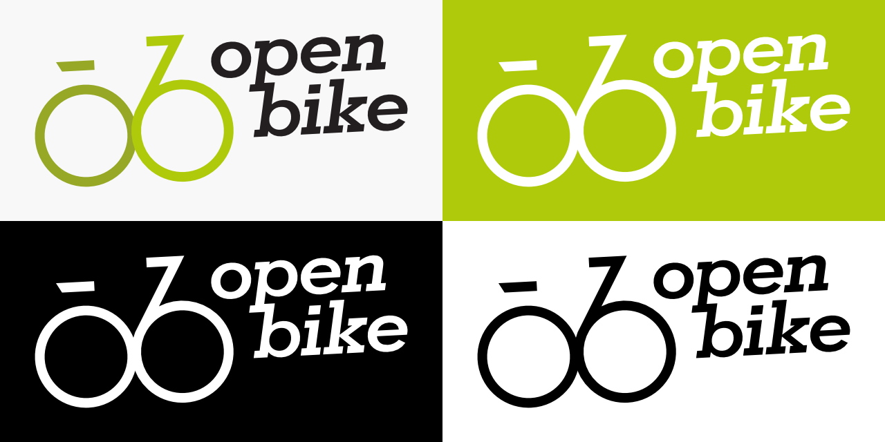

.. _`operator-brand`:

Brand guidelines
================

You may use the OpenBike name and logo if you operate a (bike) sharing system in order to show that it is based on the OpenBike software.
OpenBike is the software stack.
Your local deployment is whatever you want to call it, and it will be using the OpenBike software stack.

In our initial test deployment we also called that deployment “OpenBike”.
In retrospect, this might not have been the smartest move and should have been a different name.
But here we are, and if you feel you absolutely *must* call your deployment something like “OpenBike $cityname”, that is within your rights and possible.

Logo
----

Use the green/black or black version on bright backgrounds, the white version on dark backgrounds. Make sure that enough blank space is around the logo.

Source
------

You can find the editable source files for the logo in the `OpenBike GitHub Repository <https://github.com/stadtulm/openbike>`_.

Fonts
-----

* `Geometric Slabserif 703 (Std Bold Italic) <https://www.linotype.com/de/1084335/geometric-slabserif-703-bold-italic-product.html>`_ 
* `Quicksand <https://github.com/andrew-paglinawan/QuicksandFamily>`_

Colors
------

* light green
	* CMYK 40 / 0 / 100 / 0
	* RGB 175 / 202 / 11
	* ``#afca0b``
* dark green
	* CMYK 50 / 20 / 100 / 0
	* RGB 150 / 168 / 37
	* ``#96a825``
