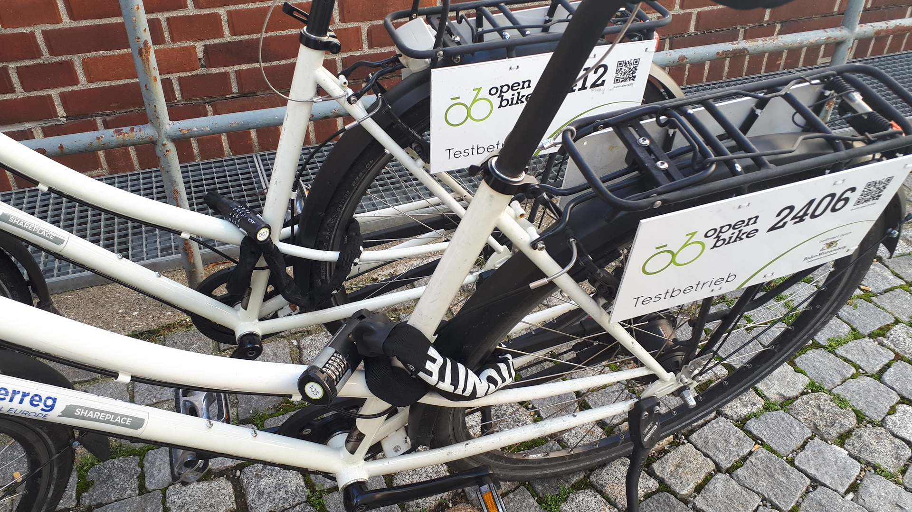
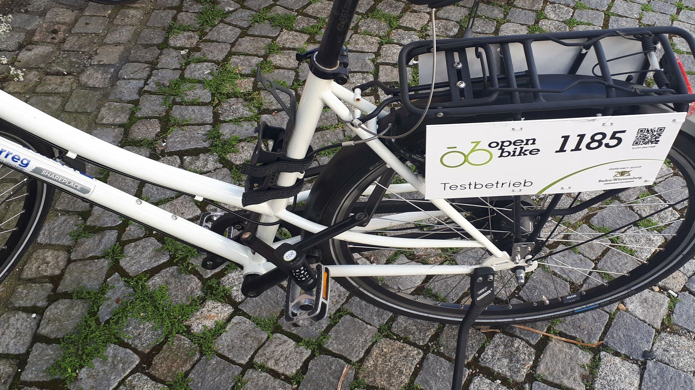
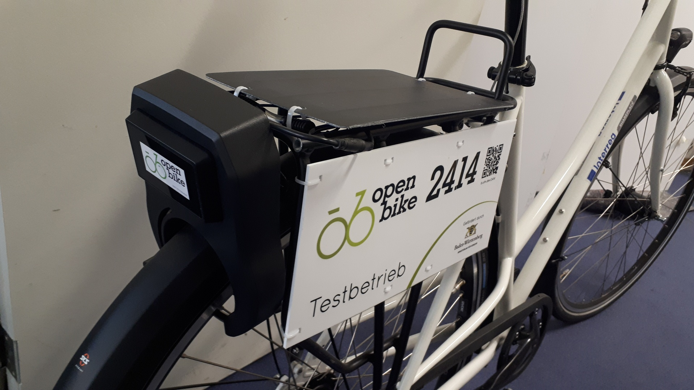
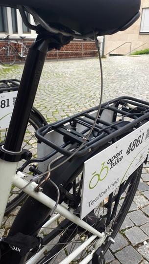

.. _`operator-locks`:

Locks
================

Combination Locks
-----------------
The by far simplest and cheapest solution to secure your bikes are classic number combination locks. There are hundreds of different types available on the market. In general, when purchasing locks, try to find a good compromise between security and weight / transportability.

Many locks can be broken with a simple bolt cutter. To avoid this, we focused on metal chain locks. 

   
   In practice, we saw many users preferring bikes with a lighter and more flexible chain over those with heavier ones. 

We have also been using some foldable locks. With the corresponding case attached to the saddle bar, these can be transported easily. On the other hand, it is slightly more difficult to attach them e.g. to a street lamp, so the risk of the bike just being "carried away" is higher.

   
   Foldable Lock

Another very important factor is the unlock mechanism. This should be as simple as possible, since it can be an annoying obstacle for new users otherwise. Unfortunately, we have not found a lock that incorporates a really self-explanatory mechanism yet.

In general, there is no ultimate combination lock for bikesharing. Feel free to try out multiple lock types and choose the one that fits the needs of both you and your consumers best.

Smart Locks
-----------

Professional bike sharing providers often use electronic "smart locks". We have been experimenting with some models and are working on integrating them into OpenBike. However, we have not tested these locks on a larger scale. 

If you can imagine using smart locks (some day), make sure your sharing bikes have the right measures to install them - do this before purchasing the bikes, at best :). The typical place for assembly is in the gap between saddle and luggage carrier.

   
   Smart lock with solar panel. To get it assembled, a part of the luggage carrier had to be sawed off.

Commercial
^^^^^^^^^^
If you are interested in getting started with some ready-to-use commercial locks, we already have some working adapters for you:

* `Cykel Adapter for Omni locks <https://github.com/stadtulm/cykel-lock-omni>`_
* `Cykel Adapter for Jimi/Concox BL10 locks <https://github.com/stadtulm/cykel-lock-bl10>`_

Almost all commercial locks ship with integrated GPS trackers and use cellular network for data transmission. See :ref:`our tracker section <trackers>` for more information on this.

OpenBike Lock PCB
^^^^^^^^^^^^^^^^^
During the OpenBike project, we have been working on a special PCB that fits in most smart locks, incorporates movement detection, a GPS + WiFi positioning system and uses LoRaWAN for data transmission. Firmware files can already be found `here <https://github.com/stadtulm/lock>`_, the PCB itself will hopefully be released as Open Hardware soon.

Secure the saddle!
------------------

Last but not least: A lock is not always enough. If you are using adjustable saddles, we highly recommend you to take some anti-theft measures. For example, during our deployment in Ulm, we just took a flexible, but solid wire and tied it to saddle and bike. If someone really wanted to steal the saddle, they could probably still do. However, just serving as some form of detention, it might have an effect.

